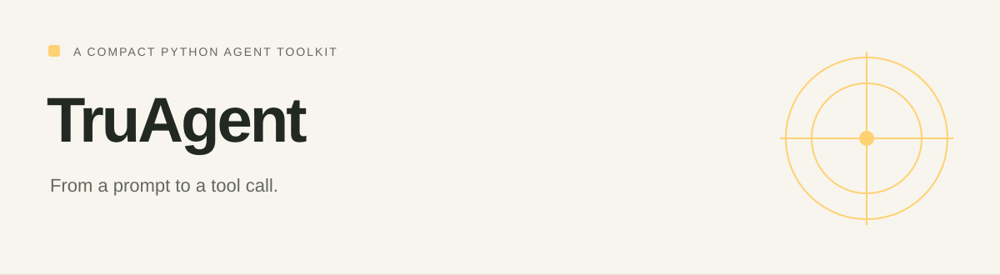

# TruAgent

<!-- repo-badges:start -->
<div align="center">

[](https://github.com/honeyamn10-source/truagent/stargazers)
[](https://github.com/honeyamn10-source/truagent/forks)
[](https://github.com/honeyamn10-source/truagent/issues)
[](https://github.com/honeyamn10-source/truagent/commits/main)

[Repository](https://github.com/honeyamn10-source/truagent) · [Issues](https://github.com/honeyamn10-source/truagent/issues) · [Pull Requests](https://github.com/honeyamn10-source/truagent/pulls) · [Actions](https://github.com/honeyamn10-source/truagent/actions)

</div>
<!-- repo-badges:end -->

<!-- professional-meta:start -->
<div align="center">

[](https://github.com/honeyamn10-source/truagent/actions/workflows/ci.yml) [](https://github.com/honeyamn10-source/truagent/actions/workflows/release.yml)

   

[Documentation](docs) · [Examples](examples) · [Contributing](CONTRIBUTING.md) · [Security](SECURITY.md) · [Changelog](CHANGELOG.md)

</div>
<!-- professional-meta:end -->


A Python agent library and command-line runner with no third-party runtime dependencies.

[Project website](https://honeyamn10-source.github.io/truagent/) · [Source](https://github.com/honeyamn10-source/truagent) · [Build results](https://github.com/honeyamn10-source/truagent/actions) · [Issues](https://github.com/honeyamn10-source/truagent/issues)

## What it does

- **Run from a terminal.** The truagent command connects a prompt to an OpenAI-compatible model.
- **Build with Python.** Tool registration, memory, parsing and middleware are available as modules.
- **Keep the core small.** The runtime uses the Python standard library; development tools are optional extras.

## Start from source

Python 3.9 or later. Configure OPENAI_API_KEY for a hosted endpoint or choose a local --base-url and --model.

```bash
git clone https://github.com/honeyamn10-source/truagent.git
cd truagent
python -m pip install .
truagent version
truagent run "Explain what a Python iterator does" --max-steps 4
```

## Check your changes

```bash
python -m pip install -e ".[dev]"
python -m pytest
```

These are the repository’s checks, not a claim of complete test coverage. See [GitHub Actions](https://github.com/honeyamn10-source/truagent/actions) for the result on a specific commit.

## Scope and limitations

Install from this repository. A package version in the source is not proof of a published PyPI release. Provider requests can incur costs.

## Find your way around

| Source | Purpose |
| --- | --- |
| [`truagent/cli.py`](truagent/cli.py) | Command-line options |
| [`examples/calculator_agent.py`](examples/calculator_agent.py) | Tool example |
| [`truagent/agent.py`](truagent/agent.py) | Agent implementation |

## Contributing

Include the command you ran, your runtime version, a minimal reproduction and the expected result in an issue. Remove credentials and personal data from logs. Follow [CONTRIBUTING.md](CONTRIBUTING.md) when proposing a change.

## License

MIT — see [LICENSE](LICENSE). Third-party dependencies retain their own licenses.
